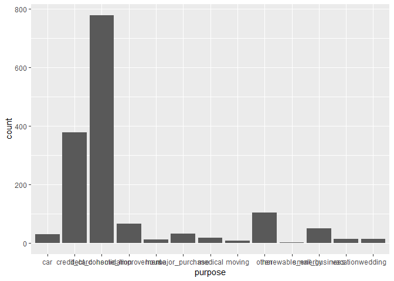

## Steps of Experiment

* Planning - Formulate hypothesis/question(s); dependent variable; independent variables; population of interest
* Design - choosing design (logit regression, factorial design)
* Analysis

Randomization, Replication and Blocking to keep bias low and asses variability of outcome.

Randomization helps spread any variability that exists naturally between subjects evenly across groups.
Replication repeats experiment to fully asses variability. Need to repeat an experiment with an adequate number of subjects to achieve an acceptable statistical power.
Blocking helps control variability by making treatment groups more alike. Inside the groups the differences will be minimal; Across groups the differences will be larger.  
  
Data set - `ToothGrowth`  
Has results of study that examined the effect of three different doses of Vitamin C on the length of the odontoplasts cells (responsible for tooth growth) in 60 guinea pigs.  
`len` variable is the outcome variable corresponding to the tooth length.  
Suppose its known that the average length of the guinea pigs odontoplasts is 18 micrometers, lets conduct a t-test to check that the mean of `len` is not equal to 18.


```r
# Load dataset as a dataframe
data(ToothGrowth)


t.test(x=ToothGrowth$len, alternative = "two.sided", mu = 18)
```

```
## 
## 	One Sample t-test
## 
## data:  ToothGrowth$len
## t = 0.82361, df = 59, p-value = 0.4135
## alternative hypothesis: true mean is not equal to 18
## 95 percent confidence interval:
##  16.83731 20.78936
## sample estimates:
## mean of x 
##  18.81333
```
In the above **two sided t-test**, the null hypothesis is that the mean of `len` is not equal to 18. Given the high p-value (0.4135 ; at significance level of 0.05) we can say that we fail to reject the Null hypothesis. Thus there is evidence to believe that the mean length of the odontoplasts is 18 micrometers.  

### Randomization

In the experiment that yielded the ToothGrowth data set, guinea pigs were randomized to receive Vitamin C either through orange juice or ascorbic acid, indicated in the data set by the `supp` variable. It's natural to wonder if there is a difference in tooth length by supplement type - a question that a t-test can also answer!


```r
# t-test to determine if there is a difference in toothlength based on supplement
ToothGrowth_ttest <- t.test(len~supp, data =  ToothGrowth)

#Load Broom
library(broom)

# Tidy ToothGrowth_ttest
tidy(ToothGrowth_ttest)
```

```
## # A tibble: 1 x 10
##   estimate estimate1 estimate2 statistic p.value parameter conf.low
##      <dbl>     <dbl>     <dbl>     <dbl>   <dbl>     <dbl>    <dbl>
## 1     3.70      20.7      17.0      1.92  0.0606      55.3   -0.171
## # ... with 3 more variables: conf.high <dbl>, method <chr>,
## #   alternative <chr>
```
  
Given the p-value of around 0.06 (above 0.05; can't reject null hypo), there seems to be no evidence to support the alternate hypothesis that there's a difference in mean tooth length by supplement type.  
  
### Replication

`count()` takes group variables as parameter. 

```r
library(dplyr)
```

```
## 
## Attaching package: 'dplyr'
```

```
## The following objects are masked from 'package:stats':
## 
##     filter, lag
```

```
## The following objects are masked from 'package:base':
## 
##     intersect, setdiff, setequal, union
```

```r
ToothGrowth %>% count(supp,dose)
```

```
## # A tibble: 6 x 3
##   supp   dose     n
##   <fct> <dbl> <int>
## 1 OJ      0.5    10
## 2 OJ      1      10
## 3 OJ      2      10
## 4 VC      0.5    10
## 5 VC      1      10
## 6 VC      2      10
```
  
In the above results we can see that the sample size for each combo of dose and supplement is 10; which is less but is deemed sufficient for this experiment.  
  
### Blocking  

Though this is not true, suppose the supplement type is actually a nuisance factor we'd like to control for by blocking, and we're actually only interested in the effect of the dose of Vitamin C on guinea pig tooth growth. If we block by supplement type, we create groups that are more similar, in that they'll have the same supplement type, allowing us to examine only the effect of dose on tooth length.

We'll use the `aov()` function to examine this. `aov()` creates a linear regression model by calling `lm()` and examining results with `anova()` all in one function call. To use `aov()`, we'll still need functional notation, as with the randomization exercise, but this time the formula should be `len ~ dose + supp` to indicate we've blocked by supplement type.


```r
library(ggplot2)
# Check effect of dos eon len visually
ggplot(ToothGrowth, aes(x = factor(dose), y = len)) + geom_boxplot()
```

<!-- -->

```r
# Create ToothGrowth_aov
ToothGrowth_aov <- aov(len ~ factor(dose) + supp, data = ToothGrowth)

# Examine ToothGrowth_aov with summary()
summary(ToothGrowth_aov)
```

```
##              Df Sum Sq Mean Sq F value   Pr(>F)    
## factor(dose)  2 2426.4  1213.2   82.81  < 2e-16 ***
## supp          1  205.4   205.4   14.02 0.000429 ***
## Residuals    56  820.4    14.7                     
## ---
## Signif. codes:  0 '***' 0.001 '**' 0.01 '*' 0.05 '.' 0.1 ' ' 1
```
  
Small p value of `dose` seems to suggest a driving effect on `len`.  
  
## Hypothesis Testing
  
Is the question in mind. There are two types of hypothesis - Null and Alternate hypo.  

**NULL HYPOTHESIS** - on the `ToothGrowth` data set would imply that there is no effect of Vit C. dosage or administration type on the length of the odontoplasts.

* there is no change
* no difference between groups
* mean, median, or observed statistic = a definite number

**ALTERNATIVE HYPOTHESIS** - 

* there is a change
* difference between groups
* mean, median, observed statistic is >, < (*one sided test*) or != a number (*two sided test*)  
  
Terms to remember -
* *Effect Size* - standardized difference of a statistic of two groups

### One Sided vs. Two Sided Tests

Recall in the first exercise that we tested to see if the mean of the guinea pigs' teeth in `ToothGrowth` data set was not equal to 18 micrometers. That was an example of a two sided test: it looked to see if the mean of `len` is some other number on either side of 18.  
  
We can also conduct a one sided test, explicitly checking to see if the mean is less than or greater than 18. Whether to use a one or two sided test usually follows from your research question. Want to know if an intervention causes longer tooth growth? One sided, greater than. Want to know if a drug causes the test group to lose more weight? One sided, less than. Simply want to know if there's a difference in test scores between two groups of students? Two sided test.  
  

```r
# Test to see if mean length of odontoplasts is less than 18 - One sided test
t.test(x=ToothGrowth$len, alternative = "less", mu = 18)
```

```
## 
## 	One Sample t-test
## 
## data:  ToothGrowth$len
## t = 0.82361, df = 59, p-value = 0.7933
## alternative hypothesis: true mean is less than 18
## 95 percent confidence interval:
##      -Inf 20.46358
## sample estimates:
## mean of x 
##  18.81333
```

```r
# Test to see if mean length of odontoplasts is less than 18 - One sided test
t.test(x=ToothGrowth$len, alternative = "greater", mu = 18)
```

```
## 
## 	One Sample t-test
## 
## data:  ToothGrowth$len
## t = 0.82361, df = 59, p-value = 0.2067
## alternative hypothesis: true mean is greater than 18
## 95 percent confidence interval:
##  17.16309      Inf
## sample estimates:
## mean of x 
##  18.81333
```
  
In both of the above one-sided tests the high p-value points to insufficient force to reject the Null hypothesis that the mean `len` is 18 micrometers.

### Power & Sample Size Calculations

**POWER** is the probability that the test correctly rejects the NULL hypo given the alternative hypo is TRUE.  
Rule of thumb in statistics is to have 80% power which needs adequate sample size to achieve.  
**SAMPLE SIZE** - as this increases, power increases; because we now have a better description of data.  
  
  
The `pwr` package can help calculate test power (can be achieved via other packages and base as well). Basically if two of *power, effect size* or *sample size* are known, the third can be calculated.
  A call to any `pwr.*()` function returns an object of class `power.htest`, which can then be manipulated in the same way as many different R objects.  
 
 

```r
library(pwr)
```

```
## Warning: package 'pwr' was built under R version 3.5.2
```

```r
# Calculate power for an example

pwr.t.test(n = 100, # number in each group
           d = 0.35, # effect size
           sig.level = 0.10, # significance level
           type = "two.sample", 
           alternative = "two.sided",
           power = NULL) # Leave the value to be caculated as NULL
```

```
## 
##      Two-sample t test power calculation 
## 
##               n = 100
##               d = 0.35
##       sig.level = 0.1
##           power = 0.7943532
##     alternative = two.sided
## 
## NOTE: n is number in *each* group
```

```r
# Calculate sample size for an example

pwr.t.test(n = NULL, 
           d = 0.25, 
           sig.level = 0.05, 
           type = "one.sample", alternative = "greater", 
           power = 0.8)
```

```
## 
##      One-sample t test power calculation 
## 
##               n = 100.2877
##               d = 0.25
##       sig.level = 0.05
##           power = 0.8
##     alternative = greater
```
  In the first example Power is calculated at 79.44%, given 100 sample size in each group, effect size of 0.35 and significance level of 0.10.  
  In the second example above the sample size is calculated at 100.29 given Power of 80%, effect size of 0.25 and significance level of 0.05.  
    
  
##  Single and Multiple Factor Experiments


### ANOVA  
  
Allows  us to test across >2 groups. For e.g. given 3 groups of sample size 100 each, ANOVA can be used to determine if the sample mean is different. The catch here however is that though the ANOVA might suggest a diiferent mean for one group over others, it will not specify the group with the different mean.
  Two ways to perform anova - 

```r
set.seed(1)
x = 1:40
y = rnorm(x)
dat <- data.frame(x=x,y=y)

# First way to ANOVA is to build model (lm/glm etc.) and then call anova()
glm.fit <- glm(y~x,data = dat)

anova(glm.fit)
```

```
## Analysis of Deviance Table
## 
## Model: gaussian, link: identity
## 
## Response: y
## 
## Terms added sequentially (first to last)
## 
## 
##      Df Deviance Resid. Df Resid. Dev
## NULL                    39     30.661
## x     1 0.075499        38     30.585
```

```r
# Second way to anova is to call aov; which builds an lm in itself
aov(y~x,data=dat)
```

```
## Call:
##    aov(formula = y ~ x, data = dat)
## 
## Terms:
##                         x Residuals
## Sum of Squares   0.075499 30.585457
## Deg. of Freedom         1        38
## 
## Residual standard error: 0.8971513
## Estimated effects may be unbalanced
```
  
Single factor experiment uses only one explanatory variable.  

```r
lendingclub <- read.csv('./lendingclub.csv')

glimpse(lendingclub)
```

```
## Observations: 1,500
## Variables: 75
## $ X                           <int> 1, 2, 3, 4, 5, 6, 7, 8, 9, 10, 11,...
## $ id                          <int> 1077501, 1077430, 1077175, 1076863...
## $ member_id                   <int> 1296599, 1314167, 1313524, 1277178...
## $ loan_amnt                   <int> 5000, 2500, 2400, 10000, 3000, 500...
## $ funded_amnt                 <int> 5000, 2500, 2400, 10000, 3000, 500...
## $ funded_amnt_inv             <dbl> 4975.00, 2500.00, 2400.00, 10000.0...
## $ term                        <fct>  36 months,  60 months,  36 months...
## $ int_rate                    <dbl> 10.65, 15.27, 15.96, 13.49, 12.69,...
## $ installment                 <dbl> 162.87, 59.83, 84.33, 339.31, 67.7...
## $ grade                       <fct> B, C, C, C, B, A, C, E, F, B, C, B...
## $ sub_grade                   <fct> B2, C4, C5, C1, B5, A4, C5, E1, F2...
## $ emp_title                   <fct> , Ryder, , AIR RESOURCES BOARD, Un...
## $ emp_length                  <fct> 10+ years, < 1 year, 10+ years, 10...
## $ home_ownership              <fct> RENT, RENT, RENT, RENT, RENT, RENT...
## $ annual_inc                  <dbl> 24000.00, 30000.00, 12252.00, 4920...
## $ verification_status         <fct> Verified, Source Verified, Not Ver...
## $ issue_d                     <fct> Dec-2011, Dec-2011, Dec-2011, Dec-...
## $ loan_status                 <fct> Fully Paid, Charged Off, Fully Pai...
## $ pymnt_plan                  <fct> n, n, n, n, n, n, n, n, n, n, n, n...
## $ url                         <fct> https://www.lendingclub.com/browse...
## $ desc                        <fct>   Borrower added on 12/22/11 > I n...
## $ purpose                     <fct> credit_card, car, small_business, ...
## $ title                       <fct> Computer, bike, real estate busine...
## $ zip_code                    <fct> 860xx, 309xx, 606xx, 917xx, 972xx,...
## $ addr_state                  <fct> AZ, GA, IL, CA, OR, AZ, NC, CA, CA...
## $ dti                         <dbl> 27.65, 1.00, 8.72, 20.00, 17.94, 1...
## $ delinq_2yrs                 <int> 0, 0, 0, 0, 0, 0, 0, 0, 0, 0, 0, 0...
## $ earliest_cr_line            <fct> Jan-1985, Apr-1999, Nov-2001, Feb-...
## $ inq_last_6mths              <int> 1, 5, 2, 1, 0, 3, 1, 2, 2, 0, 2, 0...
## $ mths_since_last_delinq      <int> NA, NA, NA, 35, 38, NA, NA, NA, NA...
## $ mths_since_last_record      <int> NA, NA, NA, NA, NA, NA, NA, NA, NA...
## $ open_acc                    <int> 3, 3, 2, 10, 15, 9, 7, 4, 11, 2, 1...
## $ pub_rec                     <int> 0, 0, 0, 0, 0, 0, 0, 0, 0, 0, 0, 0...
## $ revol_bal                   <int> 13648, 1687, 2956, 5598, 27783, 79...
## $ revol_util                  <dbl> 83.70, 9.40, 98.50, 21.00, 53.90, ...
## $ total_acc                   <int> 9, 4, 10, 37, 38, 12, 11, 4, 13, 3...
## $ initial_list_status         <fct> f, f, f, f, f, f, f, f, f, f, f, f...
## $ out_prncp                   <dbl> 0.00, 0.00, 0.00, 0.00, 766.90, 0....
## $ out_prncp_inv               <dbl> 0.00, 0.00, 0.00, 0.00, 766.90, 0....
## $ total_pymnt                 <dbl> 5861.071, 1008.710, 3003.654, 1222...
## $ total_pymnt_inv             <dbl> 5831.78, 1008.71, 3003.65, 12226.3...
## $ total_rec_prncp             <dbl> 5000.00, 456.46, 2400.00, 10000.00...
## $ total_rec_int               <dbl> 861.07, 435.17, 603.65, 2209.33, 1...
## $ total_rec_late_fee          <dbl> 0.00, 0.00, 0.00, 16.97, 0.00, 0.0...
## $ recoveries                  <dbl> 0.00, 117.08, 0.00, 0.00, 0.00, 0....
## $ collection_recovery_fee     <dbl> 0.0000, 1.1100, 0.0000, 0.0000, 0....
## $ last_pymnt_d                <fct> Jan-2015, Apr-2013, Jun-2014, Jan-...
## $ last_pymnt_amnt             <dbl> 171.62, 119.66, 649.91, 357.48, 67...
## $ next_pymnt_d                <fct> , , , , Feb-2016, , Feb-2016, , , ...
## $ last_credit_pull_d          <fct> Jan-2016, Sep-2013, Jan-2016, Jan-...
## $ collections_12_mths_ex_med  <int> 0, 0, 0, 0, 0, 0, 0, 0, 0, 0, 0, 0...
## $ mths_since_last_major_derog <lgl> NA, NA, NA, NA, NA, NA, NA, NA, NA...
## $ policy_code                 <int> 1, 1, 1, 1, 1, 1, 1, 1, 1, 1, 1, 1...
## $ application_type            <fct> INDIVIDUAL, INDIVIDUAL, INDIVIDUAL...
## $ annual_inc_joint            <lgl> NA, NA, NA, NA, NA, NA, NA, NA, NA...
## $ dti_joint                   <lgl> NA, NA, NA, NA, NA, NA, NA, NA, NA...
## $ verification_status_joint   <lgl> NA, NA, NA, NA, NA, NA, NA, NA, NA...
## $ acc_now_delinq              <int> 0, 0, 0, 0, 0, 0, 0, 0, 0, 0, 0, 0...
## $ tot_coll_amt                <lgl> NA, NA, NA, NA, NA, NA, NA, NA, NA...
## $ tot_cur_bal                 <lgl> NA, NA, NA, NA, NA, NA, NA, NA, NA...
## $ open_acc_6m                 <lgl> NA, NA, NA, NA, NA, NA, NA, NA, NA...
## $ open_il_6m                  <lgl> NA, NA, NA, NA, NA, NA, NA, NA, NA...
## $ open_il_12m                 <lgl> NA, NA, NA, NA, NA, NA, NA, NA, NA...
## $ open_il_24m                 <lgl> NA, NA, NA, NA, NA, NA, NA, NA, NA...
## $ mths_since_rcnt_il          <lgl> NA, NA, NA, NA, NA, NA, NA, NA, NA...
## $ total_bal_il                <lgl> NA, NA, NA, NA, NA, NA, NA, NA, NA...
## $ il_util                     <lgl> NA, NA, NA, NA, NA, NA, NA, NA, NA...
## $ open_rv_12m                 <lgl> NA, NA, NA, NA, NA, NA, NA, NA, NA...
## $ open_rv_24m                 <lgl> NA, NA, NA, NA, NA, NA, NA, NA, NA...
## $ max_bal_bc                  <lgl> NA, NA, NA, NA, NA, NA, NA, NA, NA...
## $ all_util                    <lgl> NA, NA, NA, NA, NA, NA, NA, NA, NA...
## $ total_rev_hi_lim            <lgl> NA, NA, NA, NA, NA, NA, NA, NA, NA...
## $ inq_fi                      <lgl> NA, NA, NA, NA, NA, NA, NA, NA, NA...
## $ total_cu_tl                 <lgl> NA, NA, NA, NA, NA, NA, NA, NA, NA...
## $ inq_last_12m                <lgl> NA, NA, NA, NA, NA, NA, NA, NA, NA...
```

```r
# Find median loan_amnt, mean int_rate, and mean annual_inc with summarise()
lendingclub %>% summarise(median(loan_amnt), mean(int_rate), mean(annual_inc))
```

```
##   median(loan_amnt) mean(int_rate) mean(annual_inc)
## 1             11500       12.94198         62252.88
```

```r
# Use ggplot2 to build a bar chart of purpose variable
lendingclub %>% ggplot(aes(purpose)) + geom_bar()
```

<!-- -->

```r
# Use recode() to create the new purpose_recode variable
lendingclub$purpose_recode <- lendingclub$purpose %>% recode( "credit_card" = "debt_related", "debt_consolidation" = "debt_related", "medical" = "debt_related","car" = "big_purchase", "major_purchase" = "big_purchase", "vacation" = "big_purchase","moving" = "life_change", "small_business" = "life_change", "wedding" = "life_change","house" = "home_related", "home_improvement" = "home_related")
```
  
We are now going to perform a single factor experiment to see how does loan purpose affect loan amount.  
Remember that for an ANOVA test, the null hypothesis will be that all of the mean funded amounts are equal across the levels of purpose_recode. The alternative hypothesis is that at least one level of purpose_recode has a different mean. We will not be sure which, however, without some post hoc analysis, so it will be helpful to know how ANOVA results get stored as an object in R.


```r
# Build a linear regression model, stored as purpose_model
purpose_model <- lm(funded_amnt~purpose_recode, data = lendingclub)

# Examine results of purpose_model
summary(purpose_model)
```

```
## 
## Call:
## lm(formula = funded_amnt ~ purpose_recode, data = lendingclub)
## 
## Residuals:
##      Min       1Q   Median       3Q      Max 
## -12144.7  -4966.9   -966.9   3533.1  26723.8 
## 
## Coefficients:
##                                Estimate Std. Error t value Pr(>|t|)    
## (Intercept)                      6992.3      786.5   8.890  < 2e-16 ***
## purpose_recodedebt_related       5974.5      811.2   7.365 2.92e-13 ***
## purpose_recodehome_related       6352.4     1108.6   5.730 1.21e-08 ***
## purpose_recodelife_change        4274.6     1127.8   3.790 0.000157 ***
## purpose_recodeother              1283.9     1033.9   1.242 0.214528    
## purpose_recoderenewable_energy  -3992.3     6856.6  -0.582 0.560479    
## ---
## Signif. codes:  0 '***' 0.001 '**' 0.01 '*' 0.05 '.' 0.1 ' ' 1
## 
## Residual standard error: 6811 on 1494 degrees of freedom
## Multiple R-squared:  0.06156,	Adjusted R-squared:  0.05842 
## F-statistic:  19.6 on 5 and 1494 DF,  p-value: < 2.2e-16
```

```r
# Get anova results and save as purpose_anova
purpose_anova <- anova(purpose_model)

# Examine class of purpose_anova
purpose_anova%>%class()
```

```
## [1] "anova"      "data.frame"
```
  The low p-value suggests that the result of the ANOVA test is statistically significant; and thus we can reject the Null hypothesis and accept the alternate hypothesios that atleast one mean is different. But which one?  
The post hoc test is done to determine which means of `purpose_recode` are different. We are going to use Tukey's HSD test (Honest Significant Difference) using the function `TukeyHSD()`.


term             comparison                          estimate     conf.low      conf.high   adj.p.value
---------------  ------------------------------  ------------  -----------  -------------  ------------
purpose_recode   debt_related-big_purchase          5974.5321     3659.725    8289.339661     0.0000000
purpose_recode   home_related-big_purchase          6352.4035     3189.038    9515.769214     0.0000002
purpose_recode   life_change-big_purchase           4274.5681     1056.354    7492.782507     0.0021645
purpose_recode   other-big_purchase                 1283.8803    -1666.372    4234.132258     0.8161957
purpose_recode   renewable_energy-big_purchase     -3992.3333   -23557.093   15572.426481     0.9922056
purpose_recode   home_related-debt_related           377.8714    -1922.577    2678.319940     0.9971881
purpose_recode   life_change-debt_related          -1699.9640    -4075.271     675.343322     0.3189031
purpose_recode   other-debt_related                -4690.6518    -6687.942   -2693.361749     0.0000000
purpose_recode   renewable_energy-debt_related     -9966.8654   -29410.759    9477.028416     0.6882294
purpose_recode   life_change-home_related          -2077.8354    -5285.737    1130.066277     0.4349662
purpose_recode   other-home_related                -5068.5232    -8007.522   -2129.524081     0.0000142
purpose_recode   renewable_energy-home_related    -10344.7368   -29907.803    9218.329274     0.6586247
purpose_recode   other-life_change                 -2990.6878    -5988.643       7.267763     0.0509787
purpose_recode   renewable_energy-life_change      -8266.9014   -27838.911   11305.108642     0.8344517
purpose_recode   renewable_energy-other            -5276.2136   -24805.951   14253.524248     0.9723693

